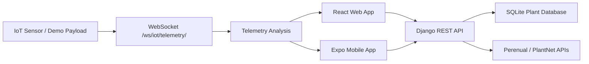

# Plantae System Guide

Plantae is a plant-care system with three parts:

- `plantae_api` - Django REST API for authentication, plant CRUD, external plant data, security controls, and WebSocket telemetry.
- `plantae` - React web app for the garden UI.
- `PlantaeMobile` - Expo mobile app using the same API contract.

## Guideline Coverage

The app now matches the main Module 4, Module 5, and overall deliverable checklist items in a simple implementation.

| Requirement | Status | Where |
|---|---:|---|
| Authentication | Complete | JWT login/register/profile in `plantae_api/plants/views.py` |
| Authorization | Complete | Protected plant/profile/discovery endpoints use `IsAuthenticated` |
| API security | Complete | JWT, throttling, validation, CORS allow-list, secure headers, no-store private responses |
| Data validation | Complete | DRF serializers validate user and plant input |
| Error handling | Complete | Consistent JSON error format |
| Logging/monitoring | Complete | Request logging middleware and log files |
| Encryption in transit | Prepared | HTTPS security settings enabled for production through environment config |
| REST API design | Complete | Versioned `/api/v1/` endpoints, pagination, filters, Swagger/ReDoc |
| IoT/WebSocket | Complete | JWT-protected `/ws/iot/telemetry/` WebSocket |
| Model integration | Complete | Incoming sensor data is analyzed into plant-health prediction/severity |
| Web/mobile integration | Complete | Web and mobile API clients include telemetry WebSocket helpers |
| Documentation | Complete | This README plus backend README and Swagger docs |

## Architecture



## Backend Setup

```bash
cd plantae_api
python -m pip install -r requirements.txt
python manage.py migrate
python manage.py seed_plants
python manage.py createsuperuser
python manage.py runserver 0.0.0.0:8000
```

API docs:

- Swagger: `http://127.0.0.1:8000/swagger/`
- ReDoc: `http://127.0.0.1:8000/redoc/`
- API root: `http://127.0.0.1:8000/api/`

## Web App Setup

```bash
cd plantae
npm install
npm start
```

Open `http://localhost:3000`.

Optional environment values:

```env
REACT_APP_API_BASE_URL=http://127.0.0.1:8000/api
REACT_APP_WS_BASE_URL=ws://127.0.0.1:8000
```

## Mobile App Setup

```bash
cd PlantaeMobile
npm install
npx expo start
```

Use Expo Go or an emulator. The mobile API client resolves the host automatically for local development.

## WebSocket Telemetry

The WebSocket endpoint is:

```text
ws://127.0.0.1:8000/ws/iot/telemetry/?token=<JWT_ACCESS_TOKEN>
```

Send a payload like this:

```json
{
  "deviceId": "demo-sensor-01",
  "plantId": 1,
  "temperature": 31,
  "humidity": 58,
  "soilMoisture": 42
}
```

The backend returns:

```json
{
  "type": "telemetry.update",
  "data": {
    "deviceId": "demo-sensor-01",
    "plantId": 1,
    "temperature": 31,
    "humidity": 58,
    "soilMoisture": 42,
    "prediction": "Plant condition stable",
    "severity": "normal",
    "alerts": [],
    "timestamp": "..."
  }
}
```

Simple model rules:

- `temperature >= 35` means high temperature.
- `humidity <= 35` means low humidity.
- `soilMoisture <= 30` means dry soil.
- Two or more alerts become `critical`; one alert becomes `warning`; no alert is `normal`.

## Security Environment

Use these values for stricter deployment:

```env
DJANGO_DEBUG=false
DJANGO_SECRET_KEY=change-this
DJANGO_ALLOWED_HOSTS=your-domain.com
DJANGO_CORS_ALLOWED_ORIGINS=https://your-frontend.com
DJANGO_CORS_ALLOW_ALL_ORIGINS=false
```

In production, put Django behind HTTPS so JWT and WebSocket traffic use TLS (`https://` and `wss://`).

## Test

```bash
cd plantae_api
python manage.py test plants
```

```bash
cd plantae
npm test
```
