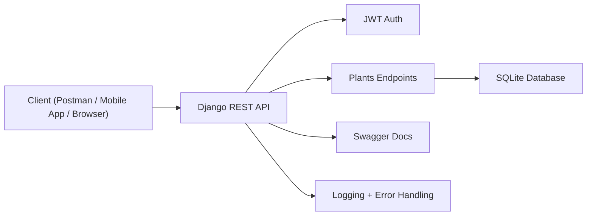

# Plantae REST API Backend

Django REST Framework backend for the **PlantaeMobile** Expo app.
This project now covers the code-side requirements of the Module 3 Web Services Checklist, with presentation screenshots still needing manual capture during the demo.

---

## Quick Start

```bash
# 1. Install dependencies
pip install django djangorestframework djangorestframework-simplejwt \
            drf-yasg django-filter django-cors-headers

# 2. Run migrations
python manage.py migrate

# 3. Seed plant data
python manage.py seed_plants

# 4. Create a superuser
python manage.py createsuperuser

# 5. Start the server
python manage.py runserver
```

Home page: **http://127.0.0.1:8000/**
API root: **http://127.0.0.1:8000/api/**
Swagger UI: **http://127.0.0.1:8000/swagger/**

---

## Checklist Coverage

| # | Checklist Item | Implementation |
|---|----------------|----------------|
| 1 | Local server running | `python manage.py runserver` -> homepage at `/` |
| 1 | API base URL accessible | `http://127.0.0.1:8000/api/` and `http://127.0.0.1:8000/api/v1/` |
| 2 | Resources clearly defined | `/api/v1/plants/` |
| 2 | Proper HTTP methods | GET, POST, PUT, PATCH, DELETE |
| 2 | Endpoint naming conventions | plural nouns, no verbs |
| 2 | API is stateless | JWT auth, no session auth in DRF |
| 3 | Standard JSON format | JSON parser and renderer configured |
| 3 | Correct request/response structure | serializers validate and shape payloads |
| 4 | Pagination | `?page=1&limit=10` |
| 4 | API versioning | `/api/v1/` |
| 4 | Caching | list and summary endpoints use 5-minute cache |
| 5 | Authentication (JWT) | `/api/token/`, `/api/token/refresh/`, `/api/token/verify/` |
| 5 | Protected endpoints | authenticated CRUD routes return 401 without token |
| 5 | Input validation | serializer validation on create/update |
| 5 | HTTPS concept | production HTTPS settings documented in `settings.py` |
| 6 | Proper HTTP status codes | 200, 201, 204, 400, 401, 404, 500 |
| 6 | Clear error messages returned | consistent JSON `error` object |
| 7 | API documentation | Swagger at `/swagger/`, ReDoc at `/redoc/` |
| 7 | Includes endpoints, params, request/response | documented with drf-yasg |
| 7 | Includes authentication and error codes | documented in Swagger and Postman collection |
| 8 | Functional testing | Django API tests plus Postman collection |
| 8 | Security testing | unauthorized access test returns 401 |
| 8 | Integration testing | API tests read/write SQLite data |
| 9 | Logging implemented | console plus `logs/plantae.log` and `logs/errors.log` |
| 9 | Errors analyzed and resolved | exceptions and HTTP errors logged |
| 9 | Data format validation ensured | serializer validation and JSON-only parsers |
| 10 | GET endpoint works | list, detail, and summary endpoints |
| 10 | POST endpoint works | create plant |
| 10 | PUT/PATCH endpoint works | full and partial update |
| 10 | DELETE endpoint works | delete plant |
| 11 | Uses appropriate framework | Django REST Framework |
| 11 | Uses testing tools | Postman collection and Swagger UI |
| 12 | Working REST API system | verified by automated test suite |
| 12 | Source code submitted | repository contains backend source |
| 12 | Documentation included | this README plus Swagger |

---

## Architecture / System Flow



Flow summary:
- Clients send JSON requests to Django endpoints.
- JWT protects private endpoints.
- Serializers validate request bodies and shape responses.
- Views read and write persisted plant data in SQLite.
- Middleware and exception handlers record request and error details.

## API Endpoints

### Authentication

| Method | Endpoint | Description |
|--------|----------|-------------|
| POST | `/api/token/` | Obtain access and refresh tokens |
| POST | `/api/token/refresh/` | Refresh access token |
| POST | `/api/token/verify/` | Verify token validity |
| POST | `/api/v1/auth/register/` | Register a user |
| POST | `/api/v1/auth/login/` | App login endpoint |
| GET/PATCH/DELETE | `/api/v1/auth/profile/` | Read, update, or delete current profile |

### Plants

| Method | Endpoint | Auth | Description |
|--------|----------|------|-------------|
| GET | `/api/v1/plants/` | Yes | List plants |
| POST | `/api/v1/plants/` | Yes | Create a plant |
| GET | `/api/v1/plants/{id}/` | Yes | Retrieve a plant |
| PUT | `/api/v1/plants/{id}/` | Yes | Replace a plant |
| PATCH | `/api/v1/plants/{id}/` | Yes | Partially update a plant |
| DELETE | `/api/v1/plants/{id}/` | Yes | Delete a plant |
| GET | `/api/v1/plants/summary/` | No | Public lightweight list |
| POST | `/api/v1/plants/identify/` | Yes | Identify a plant from an image |

Query parameters:
- `?page=1&limit=10`
- `?search=monstera`
- `?ordering=name`
- `?ordering=-created_at`
- `?light=Bright Indirect Light`
- `?water=Every 7 days`

Paginated responses use this structure:

```json
{
  "pagination": {
    "count": 12,
    "total_pages": 2,
    "current_page": 1,
    "next": "http://127.0.0.1:8000/api/v1/plants/?page=2",
    "previous": null
  },
  "results": [
    {
      "id": 1,
      "name": "Monstera Deliciosa",
      "species": "Swiss Cheese Plant",
      "imageUrl": "https://example.com/plant.jpg",
      "secretfact": "Example fact",
      "light": "Bright Indirect Light",
      "water": "Every 7 days",
      "created_at": "2026-04-18T10:00:00Z",
      "updated_at": "2026-04-18T10:00:00Z"
    }
  ]
}
```

Error responses use this structure:

```json
{
  "error": {
    "code": 400,
    "status": "BAD_REQUEST",
    "message": "Validation error. Please check the fields below.",
    "details": {
      "name": ["This field is required."]
    }
  }
}
```

## Connecting to PlantaeMobile

`getPublicPlants()` returns a paginated payload, so the mobile app should read `results`:

```js
useEffect(() => {
  getPublicPlants().then((data) => setPlants(data.results));
}, []);
```

## Testing

Automated checks included in the repo:
- Django test suite for auth, CRUD, validation, homepage, and Swagger access
- Postman collection for manual demo flows

Run locally:

```bash
python manage.py test
python manage.py check
```

## Final Deliverables Notes

Already included:
- Working backend code
- Swagger documentation
- Postman collection
- Automated API tests
- Logging configuration
- Architecture explanation

Still manual for presentation:
- Capture screenshots of Swagger and Postman while running locally
- Capture any optional load/performance evidence if your instructor asks for it
